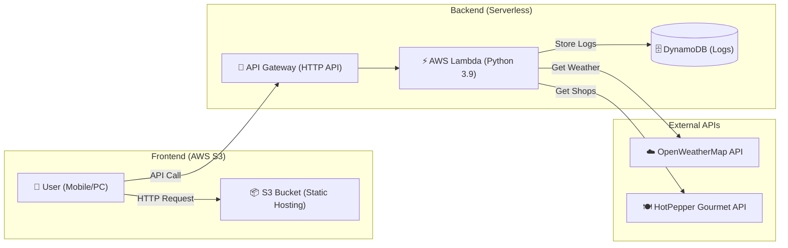

# 🌤️ お天気メシ (Otenki-Meshi)
> **現在地の天気と気温から、「今、一番食べたい」グルメを提案するAI Webアプリケーション**

<p align="left">
  
  
  
  
  
</p>
<p align="left">
  
  
  
</p>

## 🔗 Live Demo
**[🚀 アプリを使ってみる (ここをクリック)][(http://otenki-meshi-website-tf-20260224042018828000000001.s3-website-ap-northeast-1.amazonaws.com/frontend/index.html)](https://otenki-meshi-website-tf-20260224042018828000000001.s3.ap-northeast-1.amazonaws.com/frontend/index.html)** *(AWS S3 Static Website Hosting)*

## 📖 プロジェクト概要 (Overview)
「今日のお昼、何を食べよう？」 そんな日常の些細な意思決定コストを下げるために開発されたWebアプリケーションです。

OpenWeatherMap APIとホットペッパーグルメAPIを連携させ、現在地の天気・気温・湿度・時間帯に基づき、最適な飲食店をAIロジックでレコメンドします。

インフラエンジニア志望として、単なるアプリ開発にとどまらず、TerraformによるIaC (Infrastructure as Code) と GitHub ActionsによるCI/CDパイプライン を構築し、モダンで運用コストの低いフルサーバーレスアーキテクチャを実現しました。

## 🏗️ アーキテクチャ (Architecture)



## 🛠️ 技術スタック (Tech Stack)

| Category | Technology | Description |
| :--- | :--- | :--- |
| **Infrastructure** | **AWS** | Lambda, API Gateway, S3, DynamoDB |
| **IaC** | **Terraform** | インフラのコード化 (Infrastructure as Code) |
| **CI/CD** | **GitHub Actions** | デプロイの完全自動化 |
| **Backend** | **Python 3.9** | サーバーレスロジックの実装 |
| **Frontend** | **HTML5 / JS** | Tailwind CSSを用いたレスポンシブデザイン |
| **API** | **External APIs** | OpenWeatherMap, HotPepper Gourmet |

## 💡 こだわりポイント (Key Features)

### 1. 🛠️ Terraformによるインフラのコード化 (IaC)
AWSマネジメントコンソールでの手動構築によるヒューマンエラーを排除するため、全リソースを**Terraform**でコード管理しています。
- **リソース定義:** `aws_lambda_function`, `aws_apigatewayv2`, `aws_dynamodb_table` などをコード化。
- **セキュリティ:** IAMロールの**最小権限の原則（Least Privilege）**に基づいた厳格な権限設計。
- **自動化:** S3バケットポリシーやAPI Gatewayのデプロイ設定を自動適用。

### 2. ☁️ フルサーバーレス構成 (Serverless Architecture)
運用コストとスケーラビリティを考慮し、EC2を使用しない**完全サーバーレス構成**を採用しました。
- **💰 Cost:** リクエストがない待機時間は課金ゼロ（Free Tier親和性が高く、個人開発に最適）。
- **📈 Scale:** アクセス集中時もAWSマネージドサービス側で自動的にスケールアウト。

### 3. 🔄 CI/CDパイプラインの完全自動化
開発効率を最大化するため、GitHubへのPushをトリガーとして以下のフローが**GitHub Actions**により自動実行されます。
- **Frontend:** `aws s3 sync` コマンドにより、最新のHTML/CSS/JSをS3へ即時反映。
- **Backend:** Pythonコードを自動でZip圧縮し、`aws lambda update-function-code` でデプロイ。

### 4. 🧩 UXを損なわない「フォールバックロジック」
地方や郊外での利用を想定し、**「検索結果が0件」になることを防ぐロジック**を実装しました。
1. **Step 1:** 半径 **1km** 以内で検索。
2. **Step 2:** ヒットしなければ、半径 **3km** に拡張して再検索。
3. **Step 3:** それでもなければ、天候条件を緩和した広域検索を実行し、ユーザーに代替案を提示。
## 📂 ディレクトリ構成 (Directory Structure)

```text
.
├── backend/               # バックエンド (Python/Lambda)
│   └── lambda_function.py
├── frontend/              # フロントエンド (HTML/Assets)
│   ├── index.html
│   └── favicon.svg
├── terraform/             # インフラ定義 (Terraform)
│   ├── main.tf
│   └── .gitignore
└── .github/
    └── workflows/         # CI/CD設定 (GitHub Actions)
        └── deploy.yml
```

## 👤 Author

Name: PARK JEONGBIN ( パク ジョンビン )

Role: Aspiring Cloud/Infrastructure Engineer

Skill Set: AWS, Terraform, HTML, CSS, JS
