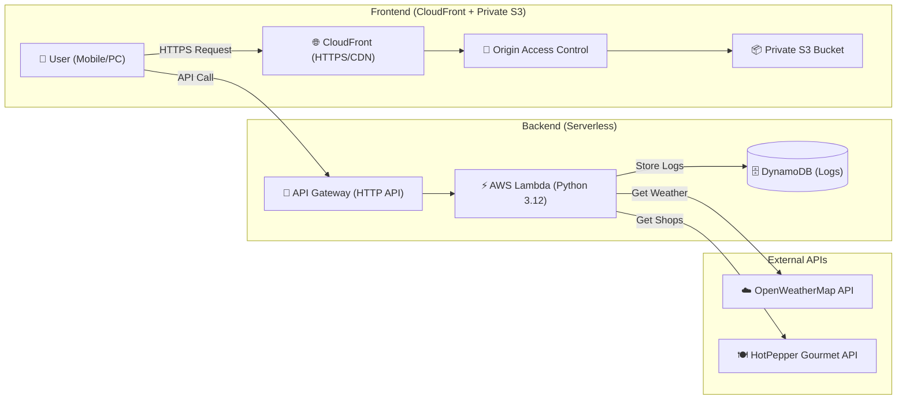

# 🌤️ お天気メシ (Otenki-Meshi)

> **現在地の天気と気温から、「今、一番食べたい」グルメを提案するAI Webアプリケーション**

<p align="left">
  
  
  
  
  
</p>
<p align="left">
  
  
  
</p>

## 🔗 Live Demo

**[🚀 アプリを使ってみる (ここをクリック)](https://d3y5as2zmx3zk.cloudfront.net/)** _(CloudFront HTTPS配信 / Private S3 + OAC)_

## 📖 プロジェクト概要 (Overview)

「今日のお昼、何を食べよう？」 そんな日常の些細な意思決定コストを下げるために開発されたWebアプリケーションです。

OpenWeatherMap APIとホットペッパーグルメAPIを連携させ、現在地の天気・気温・湿度・時間帯・曜日に基づき、最適な飲食店をスコアリング方式のレコメンドエンジンで提案します。

インフラエンジニア志望として、単なるアプリ開発にとどまらず、TerraformによるIaC (Infrastructure as Code) と GitHub ActionsによるCI/CDパイプラインを構築し、CloudFront + Private S3 + API Gateway + Lambda + DynamoDB による、モダンで運用コストの低いフルサーバーレスアーキテクチャを実現しました。

## 🏗️ アーキテクチャ (Architecture)


```mermaid
graph LR
    subgraph "Frontend (CloudFront + Private S3)"
        User["👤 User (Mobile/PC)"]
        CF["🌐 CloudFront (HTTPS/CDN)"]
        OAC["🔐 Origin Access Control"]
        S3["📦 Private S3 Bucket"]
    end

    subgraph "Backend (Serverless)"
        APIGW["🚪 API Gateway (HTTP API)"]
        Lambda["⚡ AWS Lambda (Python 3.12)"]
        DynamoDB[("🗄️ DynamoDB (Logs)")]
    end

    subgraph "External APIs"
        Weather["☁️ OpenWeatherMap API"]
        Gourmet["🍽️ HotPepper Gourmet API"]
    end

    User -->|HTTPS Request| CF
    CF --> OAC
    OAC --> S3
    User -->|API Call| APIGW
    APIGW --> Lambda
    Lambda -->|Get Weather| Weather
    Lambda -->|Get Shops| Gourmet
    Lambda -->|Store Logs| DynamoDB
```

## 🛠️ 技術スタック (Tech Stack)

| Category           | Technology         | Description                                 |
| :----------------- | :----------------- | :------------------------------------------ |
| **Infrastructure** | **AWS**            | CloudFront, S3, Lambda, API Gateway, DynamoDB, CloudWatch |
| **IaC**            | **Terraform**      | インフラのコード化 (Infrastructure as Code) |
| **CI/CD**          | **GitHub Actions** | デプロイの完全自動化                        |
| **Backend**        | **Python 3.12**    | サーバーレスロジックの実装                  |
| **Frontend**       | **HTML5 / JS**     | Tailwind CSSを用いたレスポンシブデザイン    |
| **API**            | **External APIs**  | OpenWeatherMap, HotPepper Gourmet           |

## 💡 こだわりポイント (Key Features)

### 1. 🛠️ Terraformによるインフラのコード化 (IaC)

AWSマネジメントコンソールでの手動構築によるヒューマンエラーを排除するため、全リソースを**Terraform**でコード管理しています。

- **リソース定義:** `aws_lambda_function`, `aws_apigatewayv2`, `aws_dynamodb_table`, `aws_cloudfront_distribution`, `aws_s3_bucket` などをコード化。
- **セキュリティ:** IAMロールの**最小権限の原則（Least Privilege）**に基づいた厳格な権限設計。
- **機密情報管理:** APIキーは `terraform.tfvars` で管理し、サンプルとして `terraform.tfvars.example` を用意。
- **自動化:** S3バケットポリシー、CloudFront OAC、API Gatewayのデプロイ設定を自動適用。

### 2. ☁️ フルサーバーレス構成 (Serverless Architecture)

運用コストとスケーラビリティを考慮し、EC2を使用しない**完全サーバーレス構成**を採用しました。

- **💰 Cost:** リクエストがない待機時間は課金ゼロ（Free Tier親和性が高く、個人開発に最適）。
- **📈 Scale:** アクセス集中時もAWSマネージドサービス側で自動的にスケールアウト。
- **🔐 Security:** S3はパブリック公開せず、CloudFront OAC経由でのみ静的ファイルを配信。
- **📝 Observability:** LambdaログはCloudWatch Logsで管理し、保持期間を14日に設定。

### 3. 🔄 CI/CDパイプラインの完全自動化

開発効率を最大化するため、GitHubへのPushをトリガーとして以下のフローが**GitHub Actions**により自動実行されます。

- **Frontend:** `aws s3 sync` コマンドにより、最新の静的ファイルをS3へ即時反映。
- **Backend:** Pythonコードを自動でZip圧縮し、`aws lambda update-function-code` でデプロイ。

### 4. 🤖 スコアリング方式のレコメンドエンジン

単純な `if/else` ではなく、天気・気温・湿度・時間帯・曜日などの複数要素をスコア化し、状況に合う料理ジャンルを提案します。

- **保守性:** レコメンドロジックを `backend/recommender.py` に分離し、料理候補や重みを調整しやすい設計。
- **自然さ:** 上位候補から重み付きランダムで選ぶことで、毎回同じ提案になりすぎないように調整。
- **説明可能性:** 「なぜこの提案なのか」を `reason` としてフロントエンドへ返却。
- **連続提案の抑制:** フロントエンドから直近の提案キーワードを渡し、同じジャンルが続きすぎないように減点。

### 5. 🧩 UXを損なわない「フォールバックロジック」

地方や郊外での利用を想定し、**「検索結果が0件」になることを防ぐロジック**を実装しました。

1. **Step 1:** 天候や気温に応じた検索半径で検索。
2. **Step 2:** ヒットしなければ、検索半径を拡張して再検索。
3. **Step 3:** それでもなければ、スコア上位の別キーワードで再検索。
4. **Step 4:** 最終的に時間帯ベースの汎用ワード（ランチ / カフェ / 居酒屋）で代替案を提示。

## 📂 ディレクトリ構成 (Directory Structure)

```text
.
├── backend/               # バックエンド (Python/Lambda)
│   ├── lambda_function.py
│   └── recommender.py     # スコアリング方式のレコメンドエンジン
├── frontend/              # フロントエンド (HTML/Assets)
│   ├── index.html
│   └── favicon.svg
├── terraform/             # インフラ定義 (Terraform)
│   ├── main.tf
│   ├── terraform.tfvars.example
│   ├── lambda_function.zip
│   └── .gitignore
└── .github/
    └── workflows/         # CI/CD設定 (GitHub Actions)
        ├── deploy.yml
        └── deploy-backend.yml
```

## 👤 Author

Name: PARK JEONGBIN ( パク ジョンビン )

Role: Aspiring Cloud/Infrastructure Engineer

Skill Set: AWS, Terraform, HTML, CSS, JS
